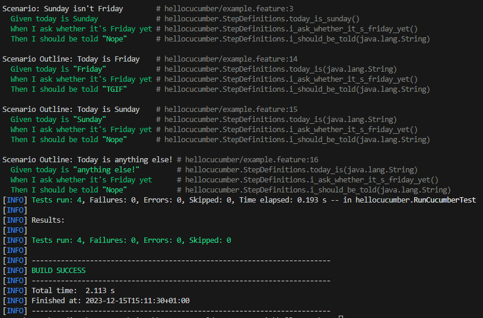

= R5.A.08 -- Dépôt pour les TPs
:icons: font
:MoSCoW: https://fr.wikipedia.org/wiki/M%C3%A9thode_MoSCoW[MoSCoW]

Ce dépôt concerne les rendus de mailto:mateo.pepin@etu.univ-tlse2.fr[Matéo Pepin].

== TP1

Fichier .feature :

[source,java]
----
Feature: Is it Friday yet

  Scenario: Sunday isn't Friday
    Given today is Sunday
    When I ask whether it's Friday yet
    Then I should be told "Nope"
    
  Scenario Outline: Today is <day>
    Given today is "<day>"
    When I ask whether it's Friday yet
    Then I should be told "<answer>"
  Examples:
    | day            | answer |
    | Friday         | TGIF   |
    | Sunday         | Nope   |
    | anything else! | Nope   |
}
----

Résultat du test :

== TP2

Fichier Order.java :

[source,java]
----
package dojo;

import java.util.List;

public class Order {
    private String owner;
    private String target;
    private List<String> cocktails;
    public void declareOwner(String x) {
        owner = x;
    }

    public void declareTarget(String x) {
        target = x;
    }

    public List<String> getCocktails() {
        return cocktails;
    }
}

----

== TP4